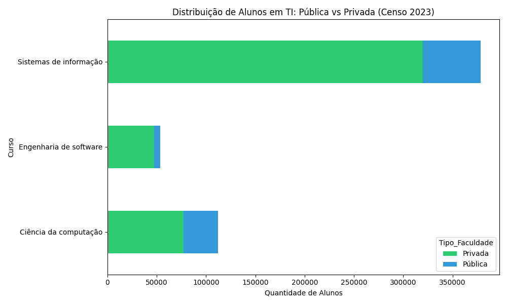

# 🇧🇷 Censo Tech Analytics: Pipeline de Dados Educacionais

> **Projeto de Engenharia de Dados** focado na análise da oferta de cursos de Tecnologia no Brasil (Pública vs Privada), processando microdados oficiais do INEP.

## 🎯 O Problema
Os microdados do Censo da Educação Superior são volumosos e complexos. Carregar esses dados em ferramentas tradicionais (Excel/Pandas puro) consome excessiva memória RAM, dificultando análises rápidas em hardware convencional.

## 🛠️ A Solução (Arquitetura)
Foi desenvolvido um pipeline **ELT (Extract, Load, Transform)** otimizado:
* **Engine:** Utilização do [DuckDB](https://duckdb.org/) para processamento OLAP em memória (SQL direto no arquivo CSV bruto).
* **Ingestão:** Leitura otimizada do arquivo `MICRODADOS_CADASTRO_CURSOS_2023.CSV`.
* **Transformação:** Normalização de categorias e agregação de matrículas via SQL.

## 💻 Tecnologias


## 📊 Resultados (Snippets)
O script gera um relatório classificado por volume de matrículas, permitindo identificar a predominância do ensino privado na oferta de cursos de Computação.

## 📊 Visualização do Mercado
Abaixo, a distribuição de alunos nos cursos de TI analisados:



```python
# Exemplo da Query Otimizada utilizada no projeto
query = """
    SELECT NO_CINE_ROTULO, SUM(QT_MAT) as Total 
    FROM read_csv_auto('dados_brutos.csv') 
    GROUP BY NO_CINE_ROTULO
"""
